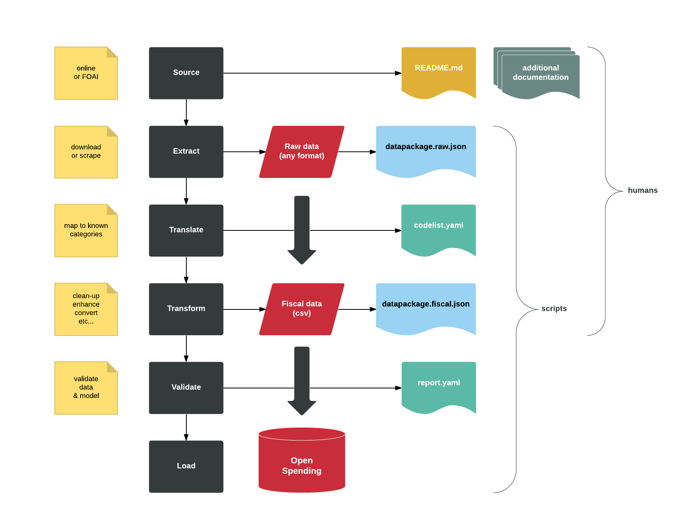

# EU Cohesion and Structural Funds 

## Introduction

Structural and Cohesion Funds are financial tools set up to implement the regional policy of the European Union. They aim to reduce regional disparities in income, wealth and opportunities. The overal budget for the 2007-2013 period was __€347 billion__ [according to wikipedia](https://en.wikipedia.org/wiki/Structural_Funds_and_Cohesion_Fund).

This repository is a __data pipeline__. It channels information about the beneficiaries of the funds into the [Open-Spending](http:next.openspending.org) datastore. The goal is to provide a __unified dataset that is easy to visualize and query__, so that citizens and journalists can follow the money on a local and global scale. 

This project is a collaborative effort between [Open-Knowledge Germany](https://www.okfn.de/en/), [Open-Knowledge International](http://okfn.org/) and a number of journalists and developers. This repository builds on research and sourcing work that was previously organised inside a [google spreadsheet](https://docs.google.com/spreadsheets/d/1RkC_YuWWlhGxyDRc-bpD_zaWAXK78GpPr8nfPesQfSY/edit?pref=2&pli=1#gid=0). 

##  What's in here?

The repository contains the following:

- `data/`: all the data goes in here
- `resources/`: project documentation and ancillary data
- `code/`: all the code goes in here
- `fields.official.yaml`: the list of fields we expect in the raw data
- `geocodes.nuts.yaml`: the nomenclature for naming countries and regions
- `datapackage.template.raw.json`: the template for raw datasets
- `datapackage.template.fiscal.json`: the template for fiscal datasets
- `codelist.yaml`: describes *category* fields common to all datasets

## Pipeline

### Philosophy

We believe that data pipelining is a fine blend of manual and automated processing. We believe in the almighty power of [Frictionless-Data](http://www.frictionlessdata.io/) to glue the two together. We believe over-engineering is a sin, albeit a really enjoyable one (*note to self*).  

### Overview

## How do I contribute?

Before you decide what to do, please:

- Read the [guidelines](guidelines.md)
- Catch up with the [wiki](https:github.com/os-data/eu-structural-funds.wiki)
- Register on the [Slack channel](https://followthesubsidies.slack.com)
- Check-out the list of [issues](https://github.com/os-data/eu-structural-funds/issues)

There are many ways to contribute, depending on your skills. You can:

- Source, document and download datasets
- Send FOAI requests for missing datasets
- Describe, translate and clean-up datasets
- Write python spiders to scrape datasets
- Write python ETL scripts to automize processes
- Raise [issues](https://github.com/os-data/eu-structural-funds/issues) about bugs in the code or the data

Please adhere to the following workflow (*note to self*):

- Fork the repository
- Create a new branch
- Make your contribution
- Send a pull request. 

Thanks!
