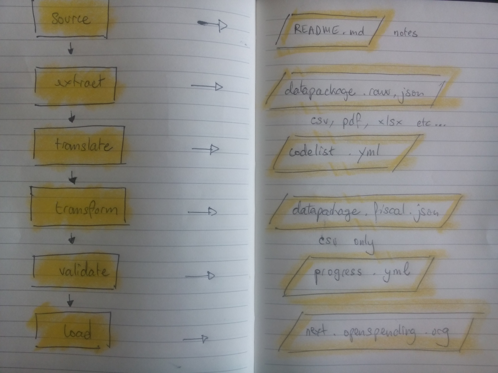

# EU Cohesion and Structural Funds 

## Overview

Structural and Cohesion Funds are financial tools set up to implement the regional policy of the European Union. They aim to reduce regional disparities in income, wealth and opportunities. The overal budget for the 2007-2013 period was __€347 billion__ [according to wikipedia](https://en.wikipedia.org/wiki/Structural_Funds_and_Cohesion_Fund).

This repository is a __data pipeline__. It channels information about the beneficiaries of the funds into the [Open-Spending](http:next.openspending.org) datastore. The goal of the project find out  all benis to get an overview of all these datasets (not just the portals) in one place, clean the data, and map them in one format. 

This project is a collaborative effort between [Open-Knowledge Germany](https://www.okfn.de/en/), [Open-Knowledge International](http://okfn.org/) and a number of journalists and developers. This repository builds on research and collection work that was previously organised inside a [google spreadsheet](https://docs.google.com/spreadsheets/d/1RkC_YuWWlhGxyDRc-bpD_zaWAXK78GpPr8nfPesQfSY/edit?pref=2&pli=1#gid=0). 

##  What's in here?

The repository contains the following files and folders:

- `data/`: all the raw data goes in there (see the guidelines).
- `ressources/`: project documentation and ancillary data
- `fields.yaml`: the list of fields we expect in the raw data
- `geocodes.nuts.yaml`: the nomenclature for naming countries and regions
- `datapackage.template.raw.json`: the template for raw datasets
- `datapackage.template.fiscal.json`: the template for fiscal datasets
- `codelist.meta.yaml`: describes *category* fields (where the choice is limited)

## The pipeline

## Philosophy

We believe that data pipelining is a fine blend of manual and automated processing. We believe in the almighty power of [Frictionless Data](http://www.frictionlessdata.io/) to glue the two together. We believe over-engineering is a sin, albeit a really enjoyable one.  

## Overview

## One step at a time

Humans do everything they possibly can in full compliance with labour laws:

- Think hard and drink lots of coffee
- Source raw datasets on the internet
- If possible, download, then describe them
- File FOIA claims to vent any accumulated frustration
- Clean up the raw data and make a fiscal data-package if 
- Write ETL scripts that tell the computer how to pick up from there 

### What the computer does

The computer does everything that's too painful to do by hand:

- Scrapes datasets that can't be easily downloaded
- Cleaning any raw data that's a pain in the ass
- Validat data modelsfiles models
- Monitors the progess of the project
- Uploads the data into Open-Spending

## How do I contribute?

- Read the [project guidelines](hguidelines.md)
- Catch up with the wiki
- Register on the [Slack channel](https://followthesubsidies.slack.com)
- Hunt for missing datasets
- Have a whole load of fun with [Open-Refine]()
- Raise issues

## Glossary
